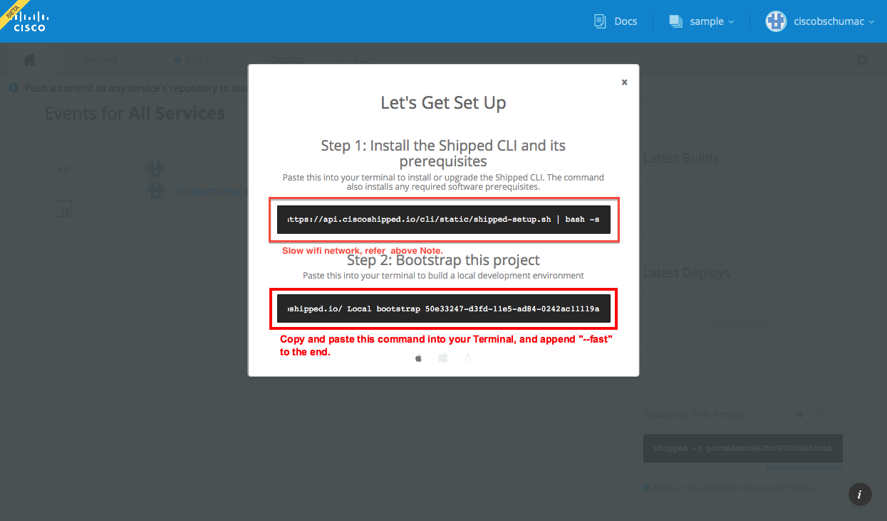

# CiscoShipped.io Walkthrough

1. Start by navigating to https://ciscoshipped.io/

2. Log into Cisco Shipped
   

3. Authorize Cisco Shipped to work with your [GitHub](https://github.com/) account
   

4. Now you can create your first app with Shipped. Compose your application by giving it a name (we recommend `sample`), and selecting a language to work with (this example uses `ExpressJS` and a repository named `expressjs`).
   
   
   


5. After you click "Build Project" you should be prompted to bootstrap your local environment. The first command downloads and installs the Shipped CLI.

    *Note*: Shipped cli install also installs Vagrant and Virtualbox as dependency. On slow network like shared wifi on conferences, to skip installing large vagrant and Virtualbox installer file set following environment variables before running first command.
    ```
    On Mac/Linux >> export SHIPPED_VM=none
    On Windows  >> SET export SHIPPED_VM=none
    ```  
     If you already have Shipped CLI installed, then copy the second command and prepare to paste it into your `Terminal` or command-line window.
   

6. When you paste the command into your `Terminal`, please add the argument `--fast` for the purposes of this walkthrough and press your `<Enter>` key.
   

7. To kick off your first build, change directory into the local code checkout, then commit and push your changes. On OS X and Linux, you can use this command:

   ```
   cd sample/expressjs && git push origin master
   ```

8. After your code is committed, it should automatically start a build.
   

9. You should now switch the the `Deploy` tab and create a new environment to deploy your application into.
   

10. This walkthrough expects the environment to be named `stage`.
   

11. Once your build has completed successfully, you can deploy it to your environment.
    

12. You can enable automatic deployments to an environment by in the `Settings` page.
    

13. To find the URI for your deployed build, you'll need to execute this command in your `Terminal`:

    ```
    shipped release getall %sample %stage
    EnvName  ProjectName  ServiceName  Status   ErrorMsg  DeployedURL
    -------  -----------  -----------  ------   --------  -----------
    stage    sample       expressjs    Success            http://stage--sample--expressjs--47497b.shipped-cisco.com

    ```
    *Note: this command will fail if you've used names different than the ones recommended above.*

    

14. Your application is [live](http://stage--sample--expressjs--47497b.shipped-cisco.com/)!
    

15. Now you can update your application in your favorite editor.
    In this example we've added this text to the end of the string on the 5th line in the `index.js` file:

    ```
    <p>Thanks for learning more about us!</p>
    ```

    

16. Now you can commit and push your changes with the commands:

    ```
    git commit -a
    git push origin master
    ```

    

17. If you have automatic deployments enabled, then your changes will be automatically staged and run after the build is successful.

    

18. And you can reload your application to see the changes you've made...
    
